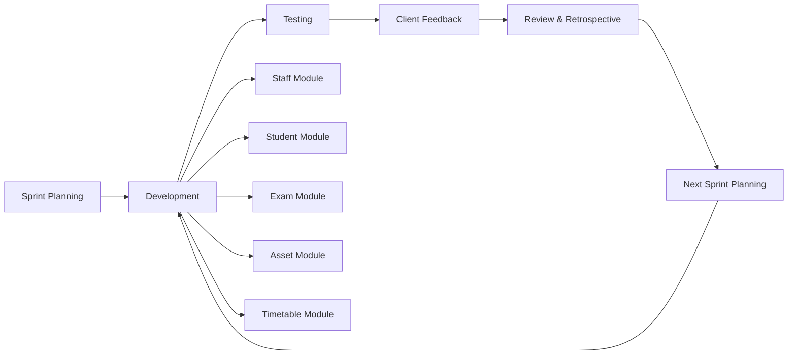
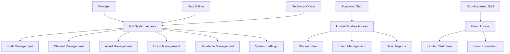

# Delta Gemunupura College DBMS

A comprehensive Android Database Management System for Delta Gemunupura College, built with modern Android development practices and Firebase backend integration.

## 🏫 Project Background

In an age where education is being reshaped by digital transformation, institutions are facing pressure to improve data-driven decision making, streamline operations, and lessen administrative burdens. Delta Gemunupura College, a government school located in Nuwara Eliya, currently manages its data manually which is inefficient. 

In order to address this issue, this project proposal includes a comprehensive plan for creating a school database management system. The goal of this system is to assist the school in digitizing and streamlining its daily operations, lowering the amount of manual labor, and enhancing access to critical data. Our goals are to increase operational effectiveness, lower mistake rates, and provide a seamless management system.

### 1.1 Background of the Client/Project

The principal of Delta Gemunupura College, a reputable institution renowned for emphasizing academic achievement and comprehensive student development, is **Mr. G.G. Kusumsiri**. The school has steadily improved its extracurricular and academic performance under his direction. Mr. G.G. Kusumsiri has updated the school's administrative procedures with a clear vision for digital transformation in order to increase accessibility and efficiency. 

This School Database Management System project was started as a result of his dedication to using technology to improve daily operations. Its goal is to streamline information flow inside the organization and lessen human labor.

Many schools still use human labor or dispersed systems to manage administrative duties including scheduling, exam records, and student and staff information. Delta Gemunupura College recognized these difficulties and looked for a solidified, easy-to-use system to facilitate everyday operations and lessen the amount of human labor. 

To meet this demand, our team recommended developing a School Database Management System that is mobile-accessible. The goal of this system is to consolidate essential administrative tasks onto a single platform, including managing staff and student information, administering exams, creating timetables, and monitoring assets. The project is being designed to satisfy the unique demands of the school using functional criteria authorized by the customer, which will increase staff and administration's usability and dependability.

## 🚀 Development Methodology

The project is implemented using the **Agile Development Process**, which promotes iterative development, continuous feedback, and the ability to change focus based on changing needs. Due to the iterative nature of agile, it is well-suited for projects pertaining to educational technology because user needs may vary as the project unfolds.

### Why Agile Methodology?

This approach is a good fit for our project for the following reasons:

• **Iterative Development**: Agile's iterative development allows developers the ability to continually re-evaluate project goals and focus by completing work in short cycles (called sprints).

• **User Engagement**: The chance for experience and feedback throughout a project allows for users to continually evaluate the solution to ensure they meet user needs and expectations.

• **Adaptability to Changing Requirements**: The requirements of the client can evolve quickly. Agile accepts changing requirements even late in a development cycle and enables us to adjust a feature and/or priority based on feedback from the principal, teachers, and the school administrative staff. This helps make the entire product relevant and more applicable during day-to-day operations of the school.

• **Efficient Use of Resources**: Agile emphasizes that the highest value feature or functionality be prioritized; development time and other resources are consumed wisely. The team can agree to focus on delivering features of greatest impact first such as providing the ability to manage student and staff information and then the team can focus on the additional modules.

## 📊 System Architecture

```mermaid
graph TB
    A[Delta Gemunupura College DBMS] --> B[Authentication Layer]
    A --> C[User Management]
    A --> D[Core Modules]
    A --> E[Data Layer]
    
    B --> B1[Firebase Auth]
    B --> B2[PIN Authentication]
    B --> B3[Biometric Auth]
    
    C --> C1[Principal]
    C --> C2[Data Officer]
    C --> C3[Technical Officer]
    C --> C4[Academic Staff]
    C --> C5[Non-Academic Staff]
    
    D --> D1[Staff Management]
    D --> D2[Student Management]
    D --> D3[Asset Management]
    D --> D4[Exam Management]
    D --> D5[Timetable Management]
    D --> D6[Attendance & Relief]
    
    E --> E1[Firebase Firestore]
    E --> E2[Realtime Database]
    E --> E3[Local Storage]
    E --> E4[File System]
```



## 🔄 Development Process Flow



## ✨ Key Features

### 🔐 **Multi-Layer Security**
- Firebase Authentication
- 4-digit PIN system
- Biometric authentication (Fingerprint/Face)
- Role-based access control

### 👥 **Staff Management**
- Complete staff records with personal and employment details
- Academic and non-academic staff classification
- Photo management and profile updates
- Access level controls

### 🎓 **Student Management**
- Comprehensive student records (Grades 6-13)
- Parent/guardian information
- Academic tracking and performance monitoring
- Grade promotion/demotion system

### 📦 **Asset Management**
- Complete inventory tracking
- Asset categorization and status monitoring
- Maintenance tracking
- Professional PDF reports

### 📝 **Exam Management**
- O/L and A/L results management
- Term test tracking for all grade levels
- Performance analytics
- Bulk and individual result exports

### ⏰ **Timetable Management**
- Class scheduling and teacher assignments
- Room and resource allocation
- PDF timetable generation
- Teacher attendance tracking

### 📊 **Reporting & Analytics**
- Professional PDF report generation
- Excel import/export capabilities
- Comprehensive data analytics
- Custom report formatting

## 🛠️ Technology Stack

- **Language**: Kotlin 1.9.22
- **Platform**: Android (API 26-34)
- **Backend**: Firebase (Firestore + Realtime Database)
- **UI**: Material Design Components
- **Architecture**: MVVM with Repository pattern
- **Security**: Multi-layer authentication system

## 📱 User Role Hierarchy



## 🚀 Getting Started

### Prerequisites
- Android Studio Arctic Fox or later
- Android SDK 26+
- Firebase project setup
- Google Services configuration

### Installation

1. **Clone the repository**
   ```bash
   git clone https://github.com/yourusername/delta-gemunupura-dbms.git
   cd delta-gemunupura-dbms
   ```

2. **Firebase Setup**
   - Create a Firebase project
   - Enable Authentication, Firestore, and Realtime Database
   - Download `google-services.json` and place it in the `app/` directory

3. **Build and Run**
   ```bash
   ./gradlew assembleDebug
   ```

## 🏗️ Project Structure

```
app/src/main/java/com/deltagemunupuramv/dbms/
├── adapter/          # RecyclerView adapters
├── fragment/         # UI fragments
├── manager/          # Business logic managers
├── model/           # Data models
├── repository/      # Data repositories
├── util/            # Utility classes
└── Activities       # UI activities
```

## 🔧 Configuration

### Firebase Configuration
The app requires Firebase configuration for:
- Authentication
- Firestore Database
- Realtime Database
- Analytics

### Permissions
- Internet access
- Camera (for profile photos)
- External storage (for file exports)
- Biometric authentication

## 👥 User Roles

- **Principal**: Full system access
- **Data Officer**: Full data management access
- **Technical Officer**: System administration access
- **Academic Staff**: Limited access to relevant modules
- **Non-Academic Staff**: Basic access to assigned modules

## 📋 Features by Module

### Staff Management
- Add/Edit/View staff records
- Photo upload and management
- Employment history tracking
- Qualification management

### Student Management
- Complete student profiles
- Academic progress tracking
- Parent/guardian information
- Grade management system

### Asset Management
- Inventory tracking
- Asset categorization
- Status monitoring
- Maintenance records

### Exam Management
- O/L and A/L results
- Term test management
- Performance analytics
- Report generation

### Timetable Management
- Class scheduling
- Teacher assignments
- Room allocation
- Attendance tracking

## 🔒 Security Features

- **Multi-factor Authentication**: Firebase Auth + PIN + Biometric
- **Role-based Access Control**: Granular permission system
- **Session Management**: Secure session handling
- **Data Encryption**: Firebase security rules
- **Offline Security**: Local data protection

## 📊 Export Capabilities

- **PDF Reports**: Professional school-branded documents
- **Excel Export**: Data import/export functionality
- **File Sharing**: Secure file provider integration
- **Custom Formatting**: School-specific document templates

## 🧪 Testing

The project includes comprehensive testing:
- Unit tests for business logic
- Instrumented tests for Android components
- UI tests with Espresso
- Firebase integration tests

## 📈 Performance

- **Offline Support**: Firebase offline persistence
- **Image Optimization**: Glide for efficient loading
- **Memory Management**: Proper resource cleanup
- **Background Processing**: Coroutines for async operations

## 🎯 Project Goals Achieved

✅ **Digitized Operations**: Replaced manual processes with digital solutions
✅ **Reduced Administrative Burden**: Streamlined daily operations
✅ **Improved Data Access**: Centralized information management
✅ **Enhanced Security**: Multi-layer authentication system
✅ **Increased Efficiency**: Automated workflows and reporting
✅ **Better Decision Making**: Data-driven insights and analytics

## 🤝 Contributing

1. Fork the repository
2. Create a feature branch (`git checkout -b feature/AmazingFeature`)
3. Commit your changes (`git commit -m 'Add some AmazingFeature'`)
4. Push to the branch (`git push origin feature/AmazingFeature`)
5. Open a Pull Request

## 📄 License

This project is licensed under the MIT License - see the [LICENSE](LICENSE) file for details.

## 📞 Support

For support and questions:
- **Principal**: Mr. G.G. Kusumsiri
- **School**: Delta Gemunupura College
- **Location**: Nuwara Eliya, Sri Lanka
- **Email**: support@deltagemunupura.edu.lk

## 🙏 Acknowledgments

- **Principal Mr. G.G. Kusumsiri** for his vision and leadership
- Firebase team for excellent backend services
- Material Design team for UI components
- Android development community
- Delta Gemunupura College administration and staff

---

**Delta Gemunupura College DBMS** - Transforming education management through digital innovation and streamlined operations.
